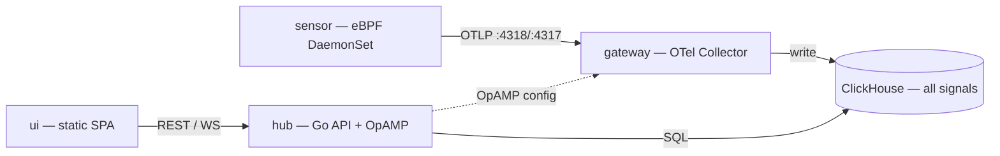
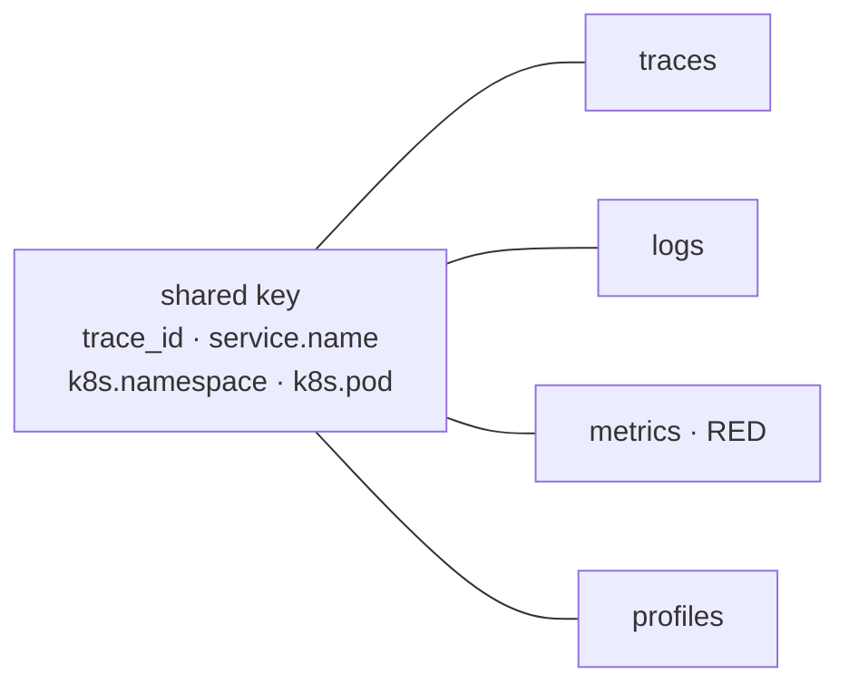
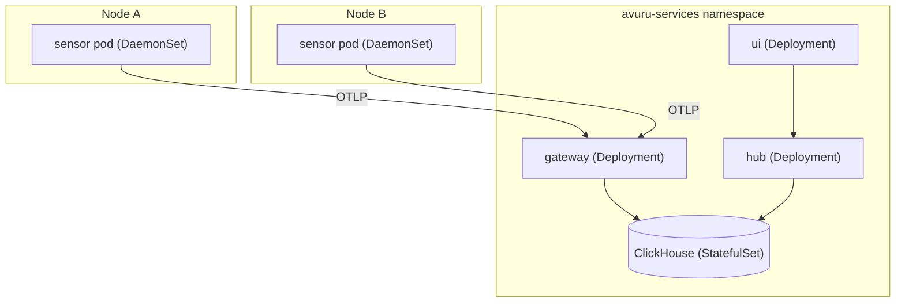

import {ArchitectureTopology} from '@site/src/components';

# Architecture

avuru obs is a handful of components, each with one job. Telemetry flows in from
the left, **every signal lands in one ClickHouse engine**, and the `hub` serves
it back to the UI. Configuration flows the other way, over OpAMP.

<ArchitectureTopology />

## The components

| Component | Role | Interfaces | Docs |
|---|---|---|---|
| **`sensor`** | eBPF DaemonSet on every node — runs OBI for zero-code traces + RED (plus OBI `network` flows), and collects logs and profiles | exports **OTLP** | [eBPF mode](/docs/setup/ebpf-mode) |
| **`gateway`** | Minimal OpenTelemetry Collector distribution — receives OTLP, filters, and writes to ClickHouse | OTLP **`:4318`** / **`:4317`** | [OTLP bridge](/docs/setup/otel-bridge) |
| **`hub`** | A single Go binary — REST `/api/v1`, WebSocket streaming and the OpAMP config plane | REST / WS · SQL | [API reference](/reference/api) |
| **`ui`** | Static SPA served from its own pod — calls the hub API | HTTP | — |
| **ClickHouse** | One columnar engine storing **every** signal | SQL | [Scaling](/docs/operations/scaling) |

## Data flow

Three paths run through the system:

1. **Telemetry path** — the `sensor` (eBPF + OTLP) ships signals to the
   `gateway`, which writes them to **ClickHouse**.
2. **Query path** — the `ui` and external clients call the `hub` REST API, which
   queries ClickHouse with SQL and streams live updates over WebSocket.
3. **Config path** — agents and collectors register with the `hub` and receive
   remote configuration over **OpAMP**.

:::note What's shipping today
Traces, logs and the service map are **live**. RED **metrics** (M3) and
continuous **profiling** (M4) are on the [roadmap](/docs/roadmap) — the diagrams
show the full target model. See [Feature status](/docs/status).
:::

## Cross-signal correlation

Storing every signal in the **same** ClickHouse cluster is what makes a pivot
from trace → logs → metrics → profile cheap: it's another query, not another
system. Signals line up on a shared key.

## Deployment topology (Kubernetes)

The `sensor` runs as a DaemonSet — one pod per node — while the `gateway`,
`hub`, `ui` and ClickHouse run as workloads in the services namespace.

## Life of a trace

1. A request hits one of your services. The node-local `sensor` observes it
   zero-code via OBI and produces the spans, with **no code change**.
2. The `sensor` exports the trace over OTLP to the `gateway`.
3. The `gateway` writes it to ClickHouse, tagged with `trace_id` and resource
   attributes (`service.name`, `k8s.pod.name`, …).
4. You open the trace in the `ui`; the `hub` reads it from ClickHouse over SQL
   and, because logs share the same `trace_id`, offers the correlated logs in the
   same view.

## Why one engine

Storing traces, metrics, logs and profiles in the **same** ClickHouse cluster is
what makes cross-signal correlation cheap: shared `trace_id` and resource
attributes mean a pivot from trace → logs → metrics → profile is just another
query, not another system to run, size and back up.

## Design decisions

Significant decisions are captured as
[ADRs](/docs/contribute/adrs/0001-docs-stack) (and as Avuru Enhancement Proposals
in the engine repo).
